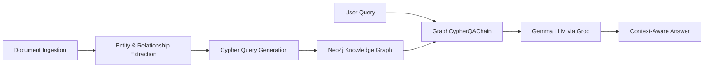
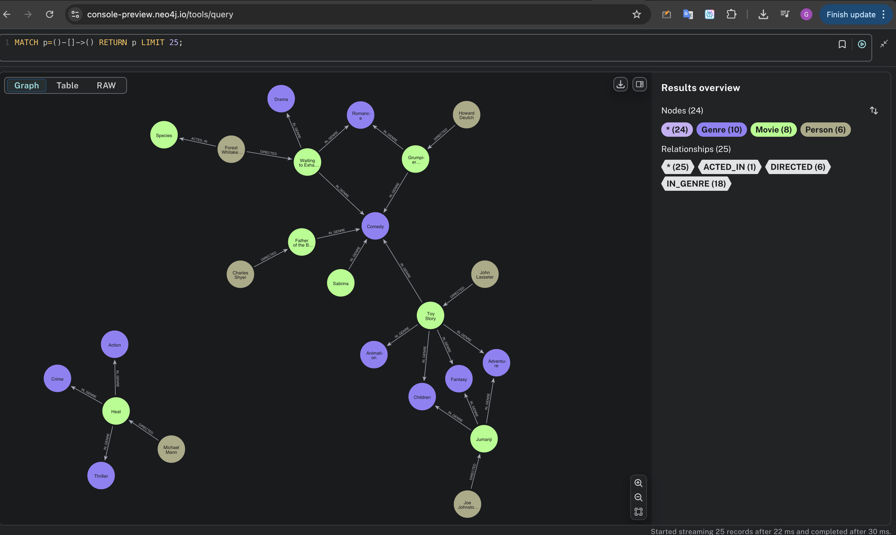
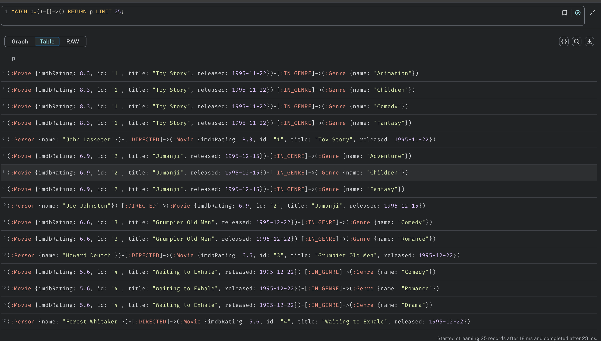

# 🚀 Graph RAG — Neo4j + Gemma (Groq) + Langchain

A **Graph-based Retrieval-Augmented Generation** system that ingests documents, builds a **Neo4j knowledge graph** with Cypher, and uses **Gemma** on the **Groq platform** for fast, accurate, relationship-aware question answering.

---

## 📌 Overview

Traditional **RAG** retrieves chunks of unstructured text via vector search.
**Graph RAG** goes further — it stores data as **entities** (nodes) and **relationships** (edges) in a **graph database**, allowing **multi-hop reasoning** and **explainable answers**.

This project:

1. Ingests documents.
2. Extracts entities and relationships.
3. Stores them in **Neo4j**.
4. Uses **LangChain’s GraphCypherQAChain** to query the graph.
5. Passes relevant context to **Gemma** (via Groq) for final answer generation.

---

## 🧠 Key Concepts

- **Graph Database (Neo4j):** Stores and queries data as nodes & edges for connected insights.
- **Knowledge Graph:** Structured network of facts linking entities and relationships.
- **RAG:** Retrieval-Augmented Generation — retrieve external data, feed to an LLM.
- **Graph RAG:** RAG enhanced with graph queries for deeper, relationship-aware reasoning.

---

## ⚙️ Architecture



---

## ▶️ Quickstart

```bash
pip install --upgrade langchain langchain-community langchain-groq neo4j

export NEO4J_URI="bolt://<host>:7687"
export NEO4J_USERNAME="neo4j"
export NEO4J_PASSWORD="<password>"
export GROQ_API_KEY="<groq-api-key>"
```

---

## 💻 Example Usage

```python
from langchain_community.graphs import Neo4jGraph
from langchain_groq import ChatGroq
from langchain.chains import GraphCypherQAChain
import os

graph = Neo4jGraph(url=os.environ["NEO4J_URI"],
                   username=os.environ["NEO4J_USERNAME"],
                   password=os.environ["NEO4J_PASSWORD"])
graph.refresh_schema()

llm = ChatGroq(groq_api_key=os.environ["GROQ_API_KEY"], model_name="Gemma2-9b-It")

chain = GraphCypherQAChain.from_llm(llm=llm, graph=graph, verbose=True, allow_dangerous_requests=True)

result = chain.invoke({"query": "Who was the director of the movie GoldenEye"})
print(result)
```

---

## 🔧 Example Cypher

```cypher
LOAD CSV WITH HEADERS FROM 'https://raw.githubusercontent.com/.../movies_small.csv' AS row
MERGE (m:Movie {id: row.movieId})
SET m.title = row.title, m.released = date(row.released), m.imdbRating = toFloat(row.imdbRating)
FOREACH (actor IN split(row.actors, '|') |
  MERGE (p:Person {name: trim(actor)}) MERGE (p)-[:ACTED_IN]->(m))
FOREACH (director IN split(row.directors, '|') |
  MERGE (p:Person {name: trim(director)}) MERGE (p)-[:DIRECTED]->(m))
FOREACH (genre IN split(row.genres, '|') |
  MERGE (g:Genre {name: trim(genre)}) MERGE (m)-[:IN_GENRE]->(g));
```

---

## 📸 Sample Output

**Database visualisation in Graph :** (you can see here ``` https://console-preview.neo4j.io/tools/query ``` )




-----

**Database visualisation in Table :**


-----

> The screenshot above shows the reasoning steps and final answer generated by the **Gemma model** after retrieving relevant nodes and relationships from **Neo4j**.

---

## 🎯 Benefits of Graph RAG

✅ Multi-hop reasoning over connected facts
✅ More accurate, explainable answers
✅ Works well in finance, healthcare, research, legal domains

---

## 📌 Tech Stack

- **Neo4j** — Graph database
- **Cypher** — Graph query language
- **Gemma** — Large Language Model
- **Groq** — High-speed inference
- **LangChain** — Orchestration

---

## ⚠️ Notes

- Use environment variables or secret managers for credentials.
- `allow_dangerous_requests=True` allows generated Cypher execution — validate queries in production.
- Enhance ingestion with NLP-based entity/relation extraction for better graph quality.
